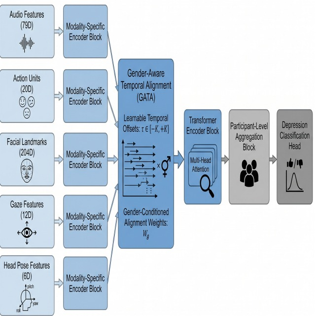
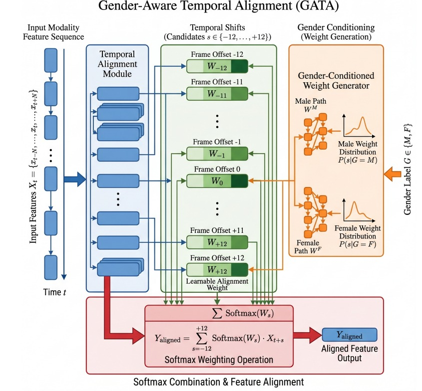

# GATA-Dep: Gender-Aware Temporal Alignment for Multimodal Depression Detection

<p align="center">
  
  <br/>
  <em>Figure 1: Overall architecture of the GATA-Dep framework.</em>
</p>

---

## Table of Contents

- [Overview](#overview)
- [Motivation](#motivation)
- [Key Contributions](#key-contributions)
- [Architecture](#architecture)
  - [Input Modalities](#input-modalities)
  - [GATA Module](#gata-module)
  - [Pipeline](#pipeline)
- [Ablation Studies](#ablation-studies)
- [Interpretability](#interpretability)
- [Author](#author)

---

## Overview

**GATA-Dep** is a multimodal deep learning framework for depression detection from clinical interviews. The model introduces a **Gender-Aware Temporal Alignment (GATA)** module that learns modality-specific temporal offsets and gender-conditioned alignment weights to better capture asynchronous behavioral signals across multiple modalities.

The framework is evaluated on the **DAIC-WOZ benchmark** and integrates audio, facial action units, facial landmarks, gaze features, and head pose signals within a transformer-based architecture.

---

## Motivation

Human behavioral cues are rarely synchronized. In depression assessment interviews, vocal changes, facial expressions, gaze shifts, and head movements often occur with **temporal delays** relative to one another. Most multimodal fusion methods assume perfect synchronization and therefore fail to capture these delayed interactions.

> **GATA-Dep** addresses this by learning temporal alignments directly from data — rather than assuming fixed synchronization.

---

## Key Contributions

- **Gender-Aware Temporal Alignment (GATA):** A novel module for multimodal behavioral modeling that learns modality-specific temporal offsets within a window of ±K frames.
- **Gender-Conditioned Alignment:** Incorporates gender information to modulate alignment distributions across modalities.
- **Transformer-Based Fusion:** End-to-end multimodal fusion architecture for participant-level depression prediction.
- **Ablation Studies** on:
  - Temporal offset range (±K)
  - Effect of gender conditioning
  - Missing-modality robustness
- **Interpretability Analysis** via learned temporal offset distributions.
- **Theoretical Grounding:** Analysis linking temporal alignment to information preservation via the Data Processing Inequality.

---

## Architecture

### Input Modalities

| Modality | Feature Dimension |
|---|---|
| Audio Features | 79D |
| Facial Action Units | 20D |
| Facial Landmarks | 204D |
| Gaze Features | 12D |
| Head Pose Features | 6D |

### GATA Module

<p align="center">
  
  <br/>
  <em>Figure 2: Detailed view of the Gender-Aware Temporal Alignment (GATA) module.</em>
</p>

The GATA module operates per modality to:

1. Estimate a distribution over temporal offsets (±K frames)
2. Condition the offset weights on a gender embedding
3. Produce a temporally re-aligned feature sequence for downstream fusion

### Pipeline

```
Audio Features (79D)
Action Units (20D)
Facial Landmarks (204D)
Gaze Features (12D)
Head Pose Features (6D)
         │
         ▼
Modality-Specific Encoders
         │
         ▼
Gender-Aware Temporal Alignment (GATA)
         │
         ▼
Transformer Encoder
         │
         ▼
Participant-Level Aggregation
         │
         ▼
Depression Classification
```

---

## Results

| Metric | Value |
|----------|----------|
| F1 Score | 0.629 |
| Precision | 0.472 |
| Recall | 0.950 |

Dataset: DAIC-WOZ

## Ablation Studies

Ablation experiments are conducted to isolate the contribution of each design choice:

| Component | Description |
|---|---|
| Temporal Offset Range | Varying ±K to assess sensitivity to alignment window size |
| Gender Conditioning | Comparing aligned vs. non-gender-conditioned offset distributions |
| Missing Modality Robustness | Evaluating performance under partial modality dropout |

---

## Interpretability

GATA-Dep provides interpretability through **learned temporal offset distributions** per modality, enabling analysis of which behavioral signals lead or lag relative to others during clinical interviews. This offers both diagnostic insight and theoretical alignment with the **Data Processing Inequality**, which motivates preserving temporal structure in multimodal representations.

---

## Author

**Arya Giri**: Indian Institute of Technology (BHU) Varanasi, Department of Biomedical Engineering
